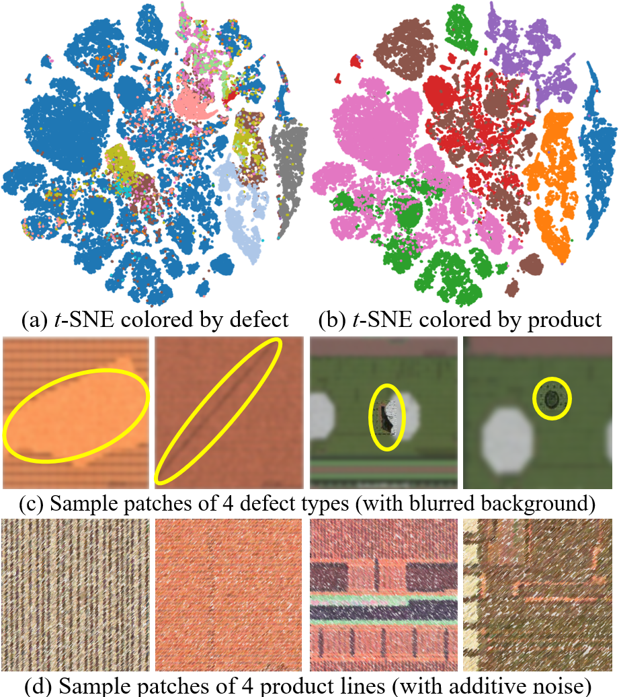

# ReCAME-Net

Exploring "Many in Few" and "Few in Many" Properties in Long-Tailed, Highly-Imbalanced IC Defect Classification  
**IEEE Transactions on Computer-Aided Design of Integrated Circuits and Systems (TCAD), 2026**

**DOI:** [https://doi.org/10.1109/TCAD.2025.3625105](https://doi.org/10.1109/TCAD.2025.3625105)

---

## Project Description

Despite significant advancements in deep classification techniques and in-lab automatic optical inspection (AOI) models for long-tailed or highly imbalanced data, applying these approaches to real-world IC defect classification tasks remains challenging. This difficulty stems from two primary factors. First, real-world conditions, such as the high yield-rate requirements in the IC industry, result in data distributions that are far more skewed than those found in general public imbalanced datasets. Consequently, classifiers designed for open imbalanced datasets often fail to perform effectively in real-world scenarios. Second, real-world samples exhibit a mix of class-specific attributes, such as defect types, and class-agnostic domain-related features, such as design characteristics of product lines. This complexity adds significant difficulty to the classification process, particularly for highly imbalanced datasets.

To address these challenges, this paper introduces the **IC-Defect-14** dataset, a large, highly imbalanced IC defect image dataset sourced from AOI systems deployed in real-world IC production lines. This dataset is characterized by its unique **intra-class clusters** property, which presents two major challenges: large intra-class diversity and high inter-class similarity. These characteristics, rarely found simultaneously in existing public datasets, significantly degrade the performance of current state-of-the-art classifiers for highly imbalanced data.

To tackle this challenge, we propose the **Regional Channel Attention-based Multi-Expert Network** (**ReCAME-Net**). This network follows a multi-expert classifier framework and integrates a regional channel attention module, metric learning losses, a hard category mining strategy, and a knowledge distillation procedure. Extensive experimental evaluations demonstrate that ReCAME-Net outperforms previous state-of-the-art models on the **IC-Defect-14** dataset while maintaining comparable performance and competitiveness on general public datasets.

---

## Figure 1

<p align="center">
  
</p>

**Figure 1.** Challenges posed by a real-world highly imbalanced IC defect image dataset. IC defect features are mixed with IC product design features, resulting in unexplored unique data properties that complicate the defect classification task.  
Figure 1-(a): The **many-in-few** property, i.e., *multi-cluster head classes*, stems from significant *intra-class diversity* in the feature space, where a single defect category exhibits multiple distinct clusters.  
Figure 1-(b): Conversely, tail classes often contain very few samples, leading to the **few-in-many** property, where a sparse number of samples are scattered across a large feature space.  
Figures 1-(c) and 1-(d): They demonstrate samples of different defect categories and product lines, highlighting that these data properties arise from different defect patterns on the same IC design and the same defect pattern on different IC designs. These unique data properties, combining diverse defect patterns and overlapping design influences, significantly complicate the classification process.

---

## Source Code

Due to the NDA, we can only provide the basic version of ReCAME-Net. This version is a specialized implementation in which ReCAME-Net is adapted for whitebait (larval fish) species classification (with *k*=2). This is the official version prepared by our co-author, Mr. Chun-Hao Chang.

---

## Availability of the IC-Defect-14 Dataset

As of May 3, 2026, the NDA required for applying to use the **IC-Defect-14** dataset has been planned and prepared. Further updates will be announced on this page when available.

---

## Citation

If you find this work useful, please cite our paper:

```bibtex
@article{shao2025exploring,
  title={Exploring ``Many in Few'' and ``Few in Many'' Properties in Long-Tailed, Highly-Imbalanced IC Defect Classification},
  author={Shao, Hao-Chiang and Chang, Chun-Hao and Lin, Yu-Hsien and Lin, Chia-Wen and Fang, Shao-Yun and Liu, Yan-Hsiu},
  journal={IEEE Transactions on Computer-Aided Design of Integrated Circuits and Systems},
  volume={45},
  number={6},
  year={2026},
  doi={10.1109/TCAD.2025.3625105},
  publisher={IEEE}
}
